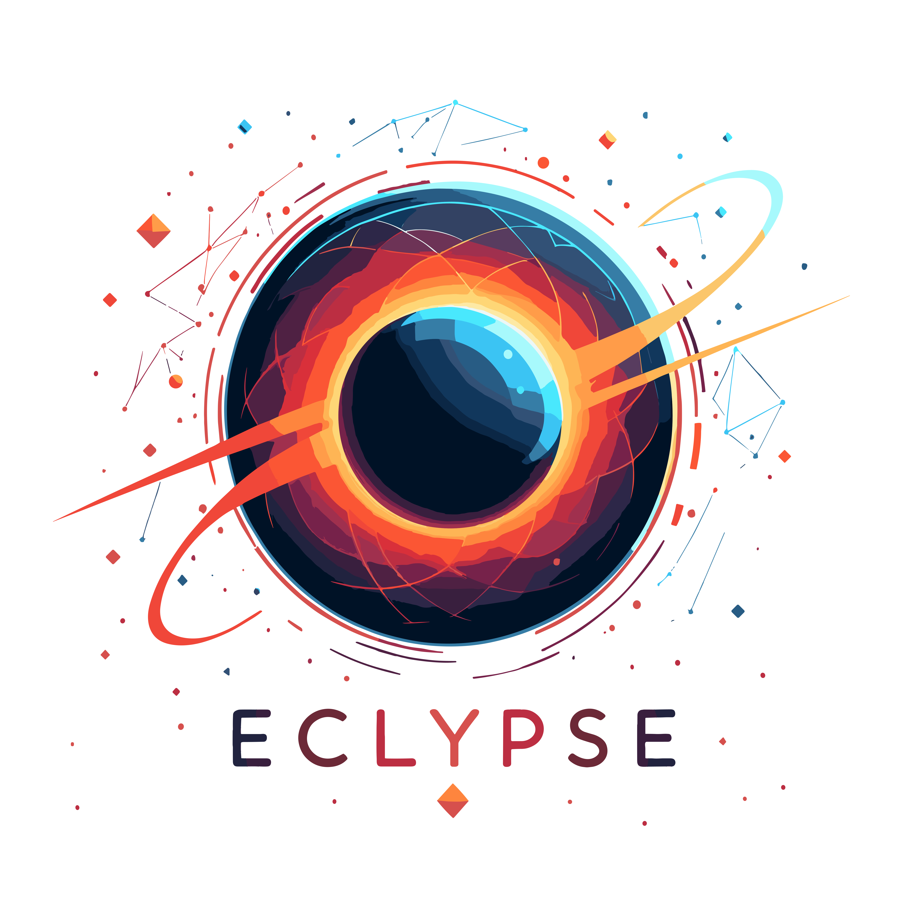
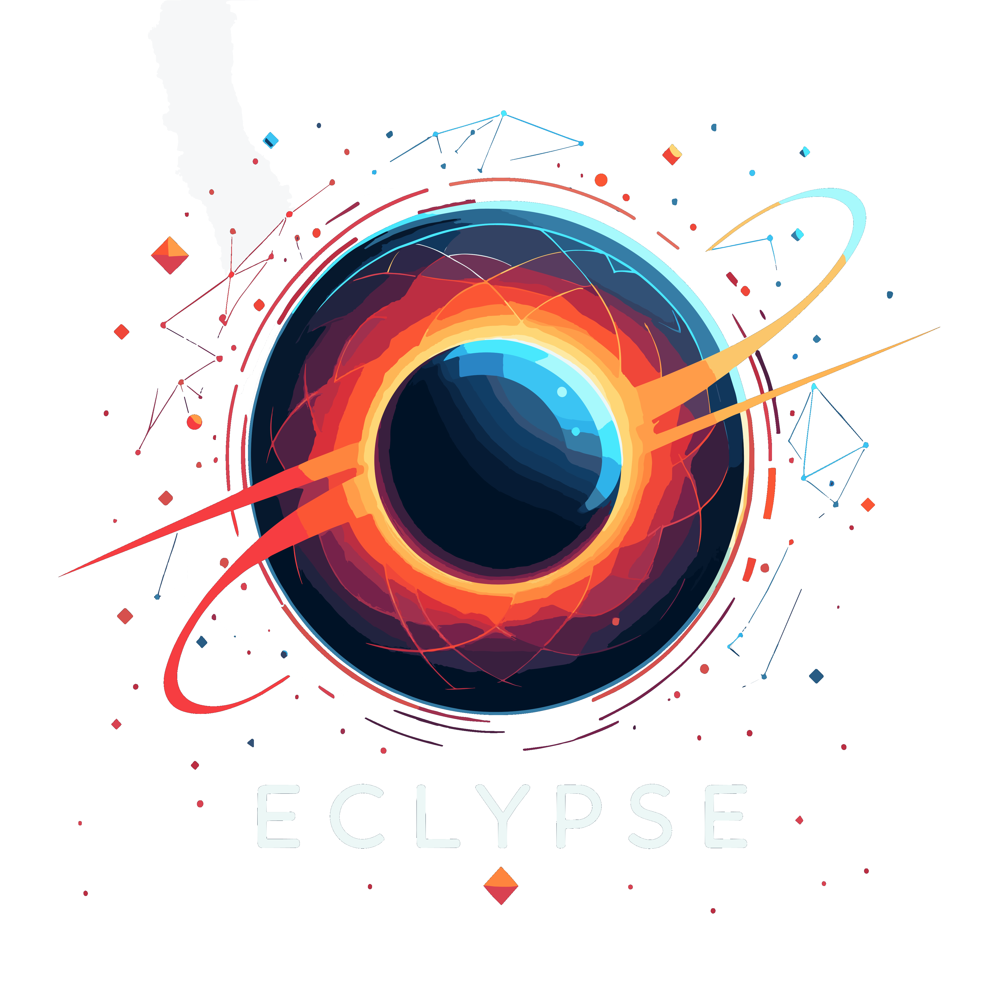

.. toctree::
   :maxdepth: 6
   :hidden:

   Overview <source/overview/index.rst>
   Reference <source/api/index.rst>

=====================
ECLYPSE documentation
=====================
**ECLYPSE** (Edge-Cloud raY-based Platform for Simulated Environments) stands as a groundbreaking simulation library, crafted entirely in Python.
It offers a practical interface for experimenting with deployment strategies across different infrastructure settings.

One of its key strengths lies in its ability to simulate the deployment of service-based applications in environments that closely mimic real-world conditions, with or without actual application implementation.
This flexibility allows users to explore various deployment strategies comprehensively, testing placement and deployment scenarios with precision.

ECLYPSE empowers developers and researchers to gain valuable insights into the nuances of deployment in diverse infrastructure scenarios, fostering informed decision-making and driving advancements in Cloud and Edge computing.

Key features include:

- **Entirely written in Python:** Accessible and adaptable for a wide range of users.
- **Easy to use:** Intuitive interface for seamless experimentation and analysis.
- **Actual implementation of services:** Simulate real-world scenarios with precise deployment strategies.
- **User-defined placement strategies and application/infrastructure update policies:** Tailor simulations to specific research or development needs, allowing for comprehensive testing and analysis.
- **Reporting of key metrics:** Provides insights into application, infrastructure, and simulation performance through various formats, aiding in comprehensive analysis and decision-making.
- **Logging capabilities:** Allows for detailed tracking and analysis of simulation activities, facilitating troubleshooting and optimization efforts.

.. button-ref:: source/overview/index
   :ref-type: myst
   :outline:
   :color: secondary
   :expand:
   :align: center
   :shadow:

   :octicon:`play;1em;info` Start using ECLYPSE
