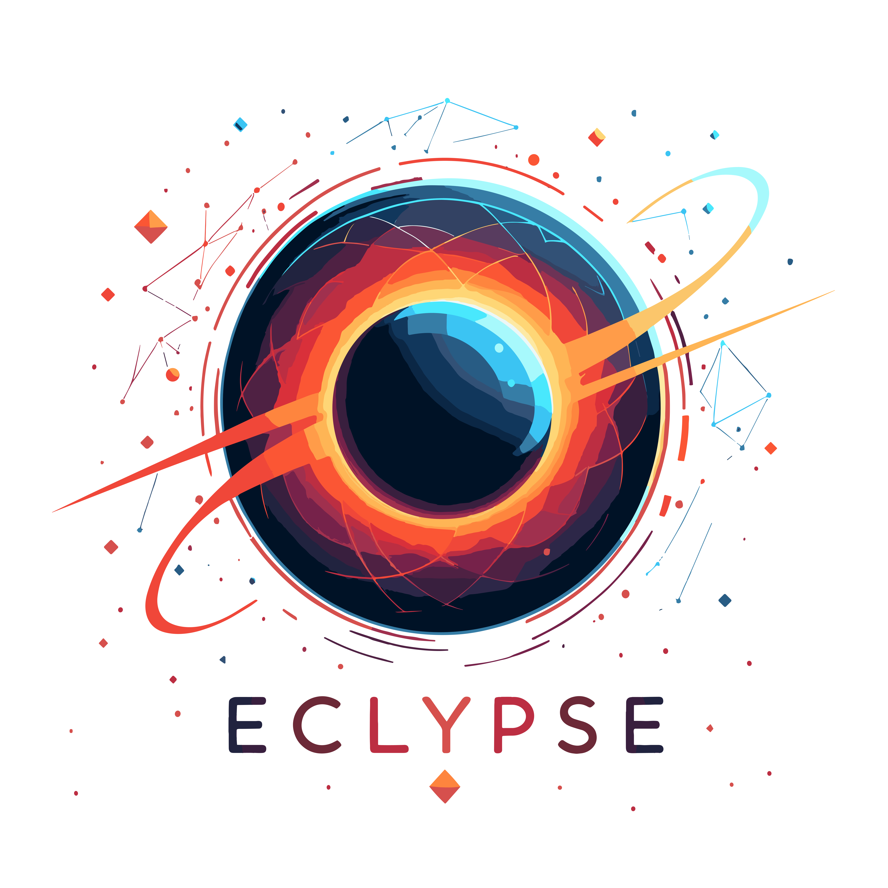
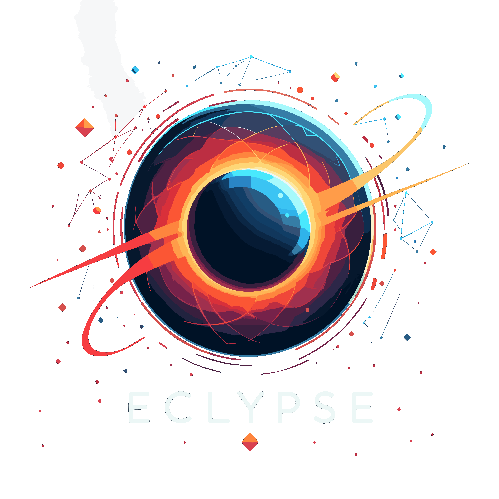

.. toctree::
   :maxdepth: 6
   :hidden:

   Overview <source/overview/index.rst>
   Reference <source/api/index.rst>
   Changelog <https://github.com/eclypse-org/eclypse/blob/main/CHANGELOG.md>

=====================
ECLYPSE documentation
=====================
**ECLYPSE** (Edge-CLoud pYthon Platform for Simulated runtime Environments)
is a Python framework for modelling service-based applications on cloud-edge
infrastructures.

It represents infrastructures and applications as resource-aware graphs, then
uses placement strategies, update policies, events, and metrics to study how a
deployment behaves over time.

You can use ECLYPSE in two modes:

- **local simulation**, where services can remain abstract graph nodes and runs
  focus on placement, resource evolution, and reporting;
- **remote emulation**, where services are implemented as concrete runtime
  objects and executed through Ray with MPI-style or REST-style communication.

Key features include:

- graph-based infrastructures and applications,
- built-in and custom placement strategies,
- dynamic update policies for resources, failures, workload, and topology,
- event, callback, and metric workflows,
- report storage through CSV, JSON, and Parquet, plus TensorBoard-compatible
  metric sinks,
- optional remote service emulation with explicit communication interfaces.

.. button-ref:: source/overview/index
   :ref-type: myst
   :outline:
   :color: secondary
   :expand:
   :align: center
   :shadow:

   :octicon:`play;1em;info` Start using ECLYPSE
